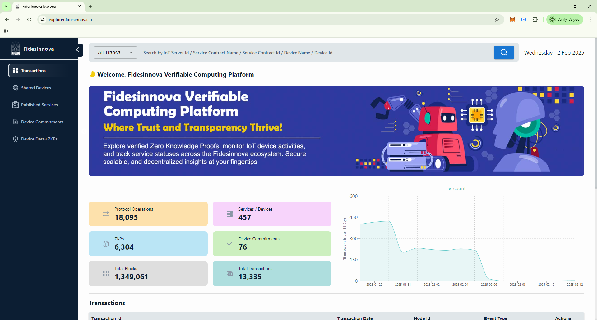
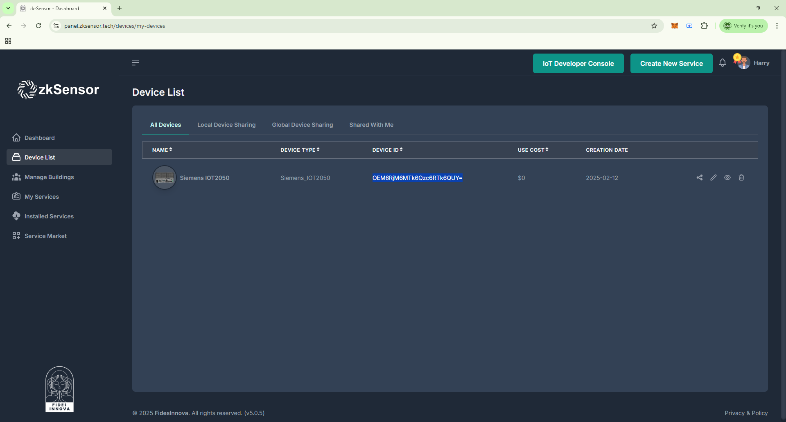
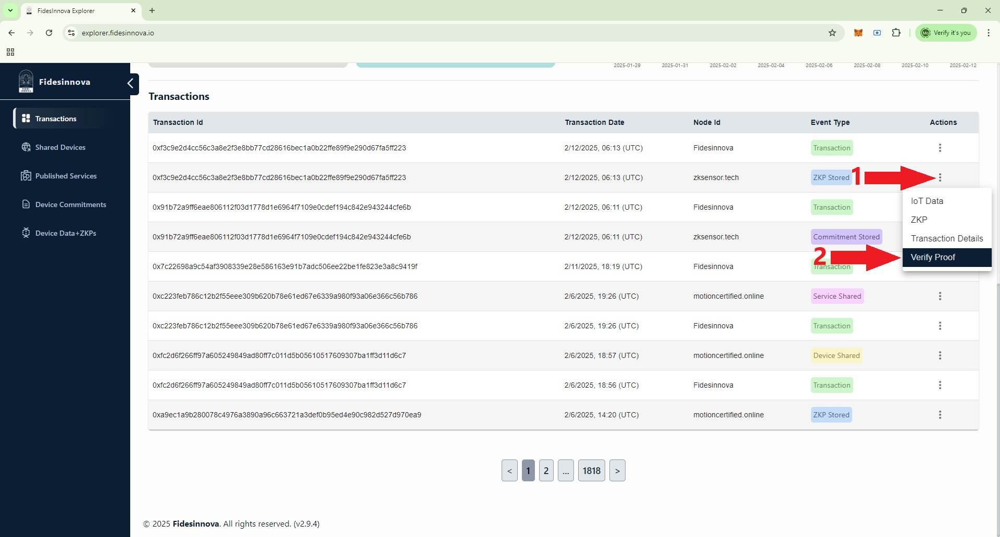
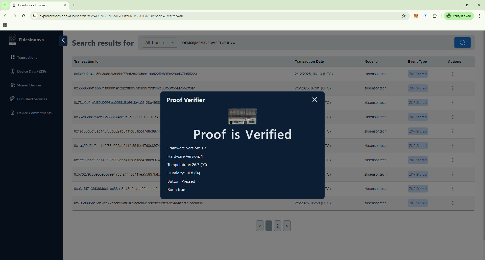

<p align="center">
  <a href="https://fidesinnova.io/" target="blank"></a>
</p>


# 🚀 Applying zk-IoT on Siemens SIMATIC IOT2050

This guide explains how to integrate **zk-IoT** with the **Siemens SIMATIC IOT2050** using the **FidesInnova** platform. The process involves device registration, commitment generation, proof submission, and verification on the blockchain.

---

## ✅ Overview of the Process

1. **Register the IOT2050 Device:**  
   - Add the Siemens IOT2050 to your account on an IoT server within the FidesInnova platform.  

2. **Generate and Submit a Commitment:**  
   - Create a cryptographic commitment for the IOT2050 program.  
   - Submit the generated commitment to the FidesInnova network.  

3. **Generate and Submit a Proof:**  
   - Generate a zero-knowledge proof (ZKP) for the IOT2050 program.  
   - Submit the proof to the FidesInnova network for verification.  

4. **Browse the Commitment and Verify the Proof:**  
   - Generate a zero-knowledge proof (ZKP) for the IOT2050 program.  
   - Submit the proof to the FidesInnova network for verification.  

---

# 🚩 Step 1: IOT2050 Registration

In this step, you’ll add the IOT2050 device to your user account on an IoT server.  

1. **Create an Account:**  
   - Sign up on an IoT server like [**zkSensor Panel**](https://panel.zksensor.tech).  

2. **Connect to Your IOT2050 Device:**  
   - Use SSH or a serial console to connect.  

3. **Install Git:**  
   ```bash
   sudo apt update
   sudo apt install git -y

4. **Clone the Repository:**  
   ```bash
   git clone https://github.com/TheArchitect2000/zkiot-arm-siemens-iot2050-c.git
   cd zkiot-arm-siemens-iot2050-c
   ```
5. **Install the Device:**
  - Execute the `wizardry.sh` script and select `1`, then follow the instructions to register your IOT2050 on Fidesinnova platform.
```
./wizardry.sh
```

# 🚩 Step 2: Commitment Generation
In this step, you should generate a commitment for your program on IOT2050 and submit it on the Fidesinnova public network.

- Install necessary libraries on IOT2050
```
sudo apt update && sudo apt install -y g++ libmosquitto-dev libmosquittopp-dev
```
- Edit the following items in `device_config.json` in the project root path:
```
{
   "class": 1,
   "deviceType": "Sensor",
   "deviceIdType": "MAC",
   "deviceModel": "Siemense ",
   "manufacturer": "MHT",
   "softwareVersion": "1.2",
   "code_block": [
      19723,
      19724
   ]
}
```
Update the following parameter:
```
"class": It corresponds to the number of gates in the ZKP circuit
"deviceType": Type of the device (e.g., Car, Sensor)
"deviceIdType": Type of the device ID (e.g., 'MAC', 'VIN')
"softwareVersion": Software/firmware version of the device (e.g., '1.0.0')
"deviceModel": Model of the device (e.g., 'zk-MultiSensor', 'E-card')
"manufacturer": Manufacturer of the device (e.g., 'Simense', 'Tesla')
"softwareVersion": Software/firmware version of the device (e.g., '1.0.0')
```

- The project root path has a sample program, `program.cpp`. The commitment will be generated for this program.
- Execute the wizardry.sh script to generate a commitment.
```
./wizardry.sh
```
You can find the commitment at `data/program_commitment.json`
- Submit the commitment on Fidesinnova blockchain. To learn about this step, please follow: [A.8. Submit the commitment on blockchain](https://github.com/FidesInnova/zkiot-usage/blob/main/README_Program.md#a8-submit-the-commitment-on-blockchain)
  
# 🚩 Step 3: Proof Generation
In this step, you should generate proofs by running the program on IOT2050 and submit it on the Fidesinnova public network.
- For this demo, you can use `wizardry.sh` script and choose option 3 to execute the program.
```
./wizardry.sh
```

# 🌐 Step 4: Browsing the Commitment and Verifying the Proofs

1. **Access the FidesInnova Explorer:**  
   - Open the [**FidesInnova Blockchain Explorer**](https://explorer.fidesinnova.io) to view your submitted commitments and proofs.  
<p align="center">
  
</p>

2. **Review Your Data:**  
   - Use the search feature to find your device ID.
<p align="center">
  
</p>
<p align="center">
  
</p>


3. **Verify the proof:**
At the transaction location, click the ` ⋮ ` and select "Verify Proof" from the menu.
<p align="center">
  
</p>
<p align="center">
  
</p>
