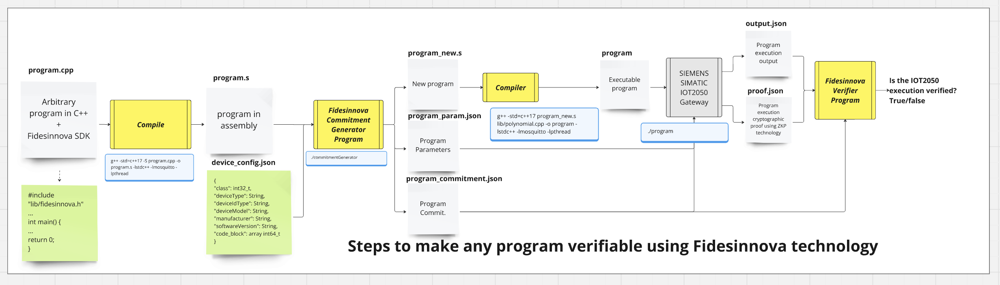
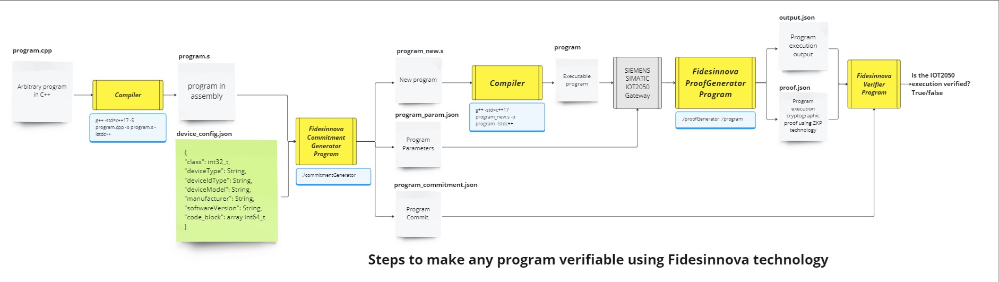
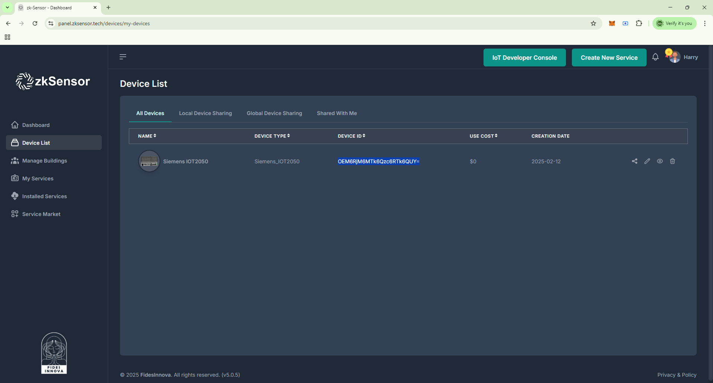
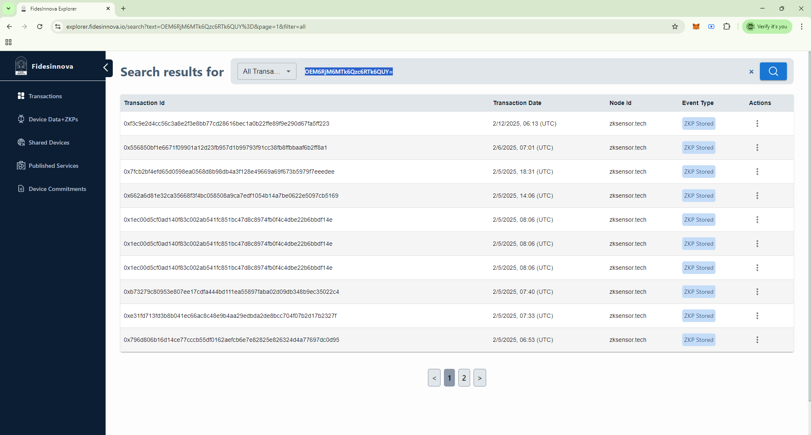
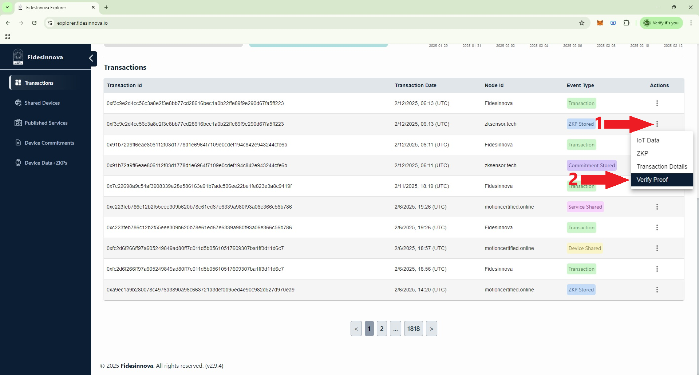
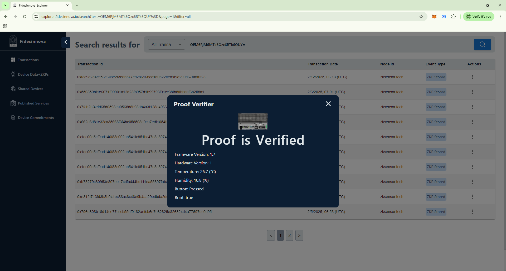

<p align="center">
  <a href="https://fidesinnova.io/" target="blank"></a>
</p>

# zk-IoT: Enabling Verifiable Computing for C++ Programs, IoT Devices, and Machine Learning Models

---

### Embedded ZKP
<p align="center">
  
</p>

### Assisted Trigger
<p align="center">
  
</p>

<a href="https://discord.com/invite/NQdM6JGwcs" target="_blank"></a>
<a href="https://twitter.com/FidesInnova" target="_blank"></a>

# zk-IoT Verifiable Computing
This repository contains two versions of a Zero-Knowledge Proof (ZKP) system designed for IoT devices. Both versions allow verifiable execution on constrained hardware, but they differ in how the ZKP algorithm itself works.

## Ver_1 — First gen ZKP Algorithm
**Integration modes supported:**
- **Assisted Trigger**
- **Embedded inside the device**

### Description
Ver_1 implements the **first-generation ZKP algorithm** used in this project.
It supports both:
- running ZKP logic fully inside the IoT device (embedded), or
- offloading proof generation / submission to an external “assisted trigger” agent.

### Characteristics
- Designed for easy integration into existing firmware.
- Works well on small devices (ARM, RISC-V).
- Simple commitment + partial-proof generation model.

## Ver_2 — New ZKP Algorithm
**Integration mode currently available:**
- **Assisted Trigger only (embedded version is planned)**

### Description
Ver_2 implements a **new and improved ZKP algorithm**, designed to be more modular, scalable, and optimized for complex IoT workloads.

### Characteristics
- Completely redesigned ZKP algorithm.
- More efficient proof handling and improved structure.
- Intended to run embedded in the future, but assisted trigger is used for now while the algorithm stabilizes.
- Better suited for larger proofs and advanced applications.


<!--
This guide will teach you how to:
- **Step A:** Create a commitment for a computation (e.g., C++ program, IoT firmware, or machine learning model) and submit it to the blockchain.
- **Step B:** Execute the computation, generate a ZK proof to demonstrate the correctness of the execution, and submit it to the blockchain.
- **Step C:** Verify the ZK proof using a blockchain explorer or a verifier program.


## ✅ Overview of the Process

1. **Register the IOT2050 Device:**  
   - Add the Siemens IOT2050 to your account on an IoT server within the FidesInnova platform.  

2. **Generate and Submit a Commitment:**  
   - Create a cryptographic commitment for the IOT2050 program.  
   - Submit the generated commitment to the FidesInnova network.  

3. **Generate and Submit a Proof:**  
   - Generate a zero-knowledge proof (ZKP) for the IOT2050 program.  
   - Submit the proof to the FidesInnova network for verification.  

4. **Browse the Commitment and Verify the Proof:**  
   - Generate a zero-knowledge proof (ZKP) for the IOT2050 program.  
   - Submit the proof to the FidesInnova network for verification.  
-->
<!--
---

# 🚩 Step 1: IOT2050 Registration

In this step, you’ll add the IOT2050 device to your user account on an IoT server.  

1. **Create an Account:**  
   - Sign up on an IoT server like [**zkSensor Panel**](https://panel.zksensor.tech).  


2. **Connect to Your IOT2050 Device:**  
   - Use SSH or a serial console to connect.  

3. **Install Git:**  
   ```bash
   sudo apt update
   sudo apt install git -y

4. **Clone the Repository:**  
   ```bash
   git clone https://github.com/TheArchitect2000/ZKP-IoT-Arm-Siemens-IoT2050-C.git
   cd zkiot-arm-siemens-iot2050-c
   ```
5. **Install the Device:**
  - Execute the `wizardry.sh` script and select `1`, then follow the instructions to register your IOT2050 on Fidesinnova platform.
```
./wizardry.sh
```

# 🚩 Step 2: Commitment Generation
Compile your code based on your operating system.
- 
```
g++ -std=c++17 commitmentGenerator.cpp lib/polynomial.cpp -o commitmentGenerator -lstdc++
```

In this step, you should generate a commitment for your program on IOT2050 and submit it on the Fidesinnova public network.
- Install necessary libraries on IOT2050
```
sudo apt update && sudo apt install -y g++ libmosquitto-dev libmosquittopp-dev
```
- Edit the following items in `device_config.json` in the project root path:
```
{
   "class": 1,
   "deviceType": "Sensor",
   "deviceIdType": "MAC",
   "deviceModel": "Siemense ",
   "manufacturer": "MHT",
   "softwareVersion": "1.2",
   "code_block": [
      19723,
      19724
   ]
}
```
Update the following parameter:
```
"class": It corresponds to the number of gates in the ZKP circuit
"deviceType": Type of the device (e.g., Car, Sensor)
"deviceIdType": Type of the device ID (e.g., 'MAC', 'VIN')
"softwareVersion": Software/firmware version of the device (e.g., '1.0.0')
"deviceModel": Model of the device (e.g., 'zk-MultiSensor', 'E-card')
"manufacturer": Manufacturer of the device (e.g., 'Simense', 'Tesla')
"softwareVersion": Software/firmware version of the device (e.g., '1.0.0')
```

- The project root path has a sample program, `program.cpp`. The commitment will be generated for this program.
- Execute the wizardry.sh script to generate a commitment.
```
./wizardry.sh
```
You can find the commitment at `data/program_commitment.json`
- Submit the commitment on Fidesinnova blockchain. To learn about this step, please follow: [A.8. Submit the commitment on blockchain](https://github.com/FidesInnova/zkiot-usage/blob/main/README_Program.md#a8-submit-the-commitment-on-blockchain)
  
# 🚩 Step 3: Proof Generation
In this step, you should generate proofs by running the program on IOT2050 and submit it on the Fidesinnova public network.
- For this demo, you can use `wizardry.sh` script and choose option 3 to execute the program.
```
./wizardry.sh
```

# 🌐 Step 4: Browsing the Commitment and Verifying the Proofs
To verify the execution of the program, you have two options:
#### **Local Verification**: Use the locally available `verifier` tool.
```
./verifier
```
#### **Fidesinnova Blockchain Explorer Verification**: Submit your proof on the blockchain, then use the Fidesinnova Blockchain Explorer to verify the submitted `proof.json`.

1. **Access the FidesInnova Explorer:**  
   - Open the [**FidesInnova Blockchain Explorer**](https://explorer.fidesinnova.io) to view your submitted commitments and proofs.  
<p align="center">
  
</p>

2. **Review Your Data:**  
   - Use the search feature to find your device ID.
<p align="center">
  
</p>
<p align="center">
  
</p>


3. **Verify the proof:**
At the transaction location, click the ` ⋮ ` and select "Verify Proof" from the menu.
<p align="center">
  
</p>
<p align="center">
  
</p>
-->
<!--
# zk-IoT: Enabling Verifiable Computing for C++ Programs, IoT Devices, and Machine Learning Models

<a href="https://discord.com/invite/NQdM6JGwcs" target="_blank"></a>
<a href="https://twitter.com/FidesInnova" target="_blank"></a>

This guide will teach you how to:
- **Step A:** Create a commitment for a computation (e.g., C++ program, IoT firmware, or machine learning model) and submit it to the blockchain.
- **Step B:** Execute the computation, generate a ZK proof to demonstrate the correctness of the execution, and submit it to the blockchain.
- **Step C:** Verify the ZK proof using a blockchain explorer or a verifier program.

These steps are outlined for three different scenarios in the following README files:
- [Enabling Verifiable Computing for C++ Programs](https://github.com/FidesInnova/zkiot/blob/main/README_Program.md)
- [Enabling Verifiable Computing for IoT Devices](https://github.com/FidesInnova/zkiot/blob/main/README_IoT.md)
- [Enabling Verifiable Computing for Machine Learning Models](https://github.com/FidesInnova/zkiot/blob/main/README_MachineLearning.md)
-->
